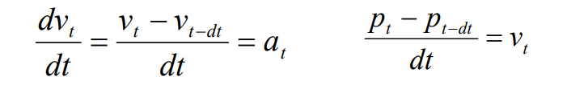

# Arno Durandeau

## Jeu de Tennis en Grapic

### But du projet

Je suis un étudiant qui aime beaucoup jouer au tennis et qui en fait depuis tout petit, alors avec les thèmes présentés dans l'UE, c'était logique pour moi de faire un jeu de tennis.  
Mais si c'était seulement un jeu de tennis, une balle qui rebondit et deux raquettes ,ca aurait été un peu simple.
J'ai donc réfléchit à tout ce que je pouvais ajouter, pour rendre le jeu plus réaliste et plus amusant.

### Contenu

#### Niveaux de difficultés:

Plusieurs niveaux de difficulté, inspirés des vraies [surfaces de terrain utilisées dans la compétition](https://imgur.com/a/lm1g2Io): 
* la terre battue
* le gazon
* l'asphalte  

Pour le fun, il y a aussi un niveau sur la lune.  
Plusieures choses changent selon la difficulté:

#### Engagement:
L'engagement (service) a lieu au centre du terrain, du côté du joueur qui a perdu le point précédent.  

#### Points et échanges:
Les points sont comptés comme un "**SET**" en compétition, on compte d'abord les points dans l'ordre: *0, 15, 30, 40*. 
Lorsqu'un joueur arrivé à *40* marque un point, les deux joueurs repartent à *0*, et le joueur qui a gagné le dernier point gagne 1 "**Jeu**".
Le premier joueur à **6 Jeux** a gagné le SET, ici, la partie.  
En compétition une "partie" ou match, se joue en 3 SET gagnants, mais cela rendrait le jeu moins amusant.  

Un point vous est attribué si votre adversaire ne rattrape pas la balle avec sa raquette, ou, en difficulté "Asphalt", si votre adversaire tire dans le filet.  
Le cas du filet est compté uniquement en 3ème difficulté, pour la simple raison qu'il est plus simple de tirer dans le filet lorsque la balle a moins de vitesse.

Il y a également un compteur d'échanges au centre-haut de la fenêtre, ainsi que le meilleur nombre d'échanges de la partie, pour se mettre au défi de battre son record.

#### Coups spéciaux:
Non, on ne peut pas faire de coups comme dans "Mario Tennis Aces" avec des attaques spéciales et des attaques enflammées.  
En revanche, dans ce jeu, on peut éffectuer tous les coups spéciaux du tennis, à savoir:
* **Amorti** : Son but est de ralentir la balle sans que l'adversaire ne s'y attende.
* **Smash** : Son but est d'accélerer la balle pour qu'elle soit plus dure à rattraper.
* **Vollée** : Son but est de se rapprocher du filet pour rattraper un amorti, ou pour surprendre l'adversaire.
* **Lob** : Son but est de rendre la trajectoire de la balle plus parabollique pour, par exemple, contrer la Vollée.  

Un bouton est associé pour chacun de ces coups (voir onglet commande). Rester appuyé sur ce bouton le rend plus puissant (LOB plus haut, SMASH plus rapide, AMORTI plus lent), mais attention, ces coups sont limités et à utiliser avec précaution.  
*Le fait qu'il faille rester appuyer sur le bouton pour accentuer le coup n'était pas prévu et était un bug, mais j'ai trouvé la mécanique de jeu intéressante. J'ai donc laissé cette mécanique et je n'ai pas patché le bug.*

#### Physique

La physique de la balle fonctionne selon la seconde loi de Newton, qui dit que la somme des forces sur un objet est égale au produit de sa masse et de son accéleration.  
Ici notre balle a comme masse m=1g, elle a donc, dans le modèle utilisé, comme seule force son accéleration.  
Lors de l'engagement, on donne à la balle une force initiale **horizontale**. Ensuite, par souci de difficulté dans le jeu, la balle n'accelerera pas tout au long des points (sinon sa vitesse augmenterait de façon exponentielle).  
Aussi, on supposera que la balle n'a que très peu de friction avec le sol, pour qu'elle ne touche pas trop vite le filet.  
Pour finir, à chaque contact avec les raquettes, on ajoute un vecteur **vertical** positif à l'acceleration de la balle, cela permet à la balle de conserver une trajectoire réaliste (pour un jeu de tennis).  
J'en convient, toutes ces légères modifications rendent le jeu moins réaliste dans son aspect physique. A l'inverse, ces modifications rendent le jeu plus réaliste dans son aspect tennistique, et c'est ce qui m'intéressait pour de ce projet.

Pour les equations de l'acceleration, de la vitesse, ainsi que de la position **en fonction du temps**, j'ai utilisé celles qui nous étaient proposées dans le cours de LIFAMI . 

